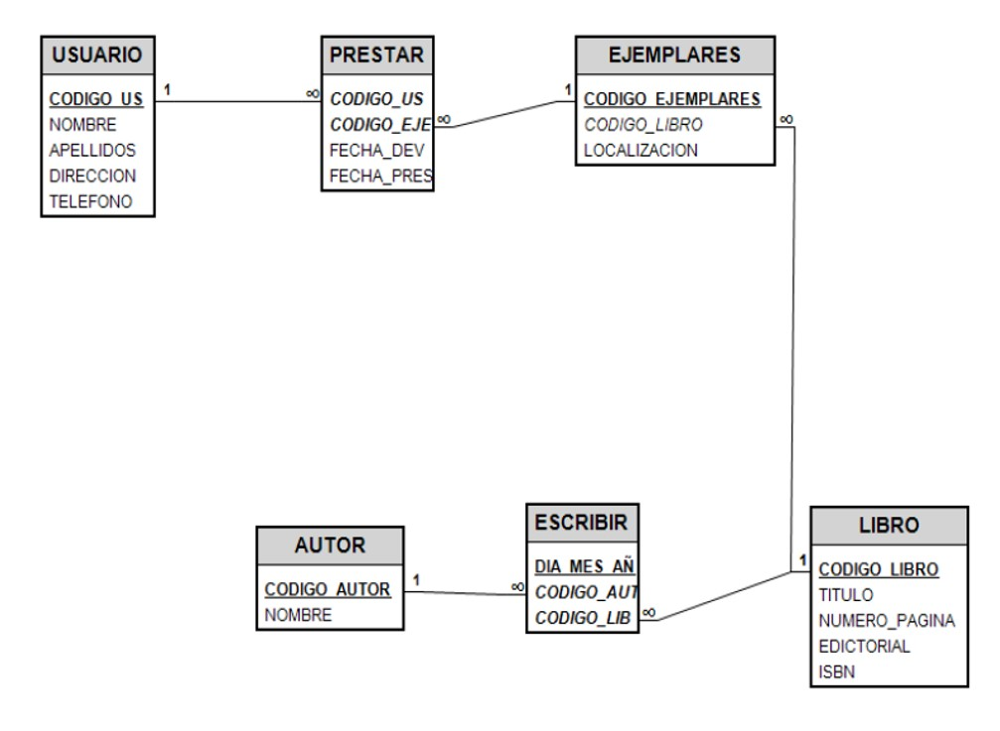
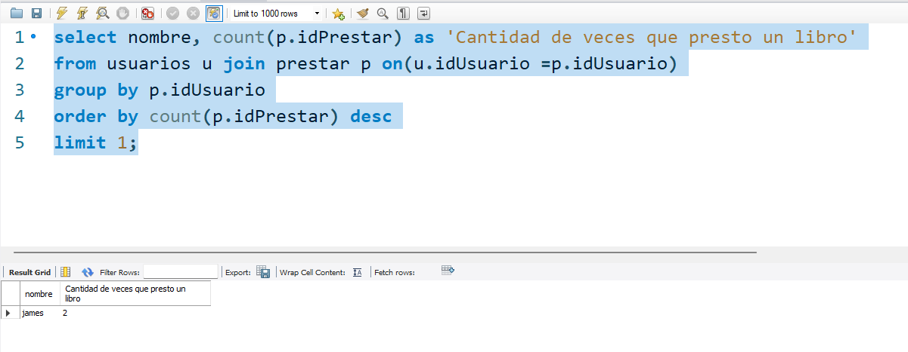
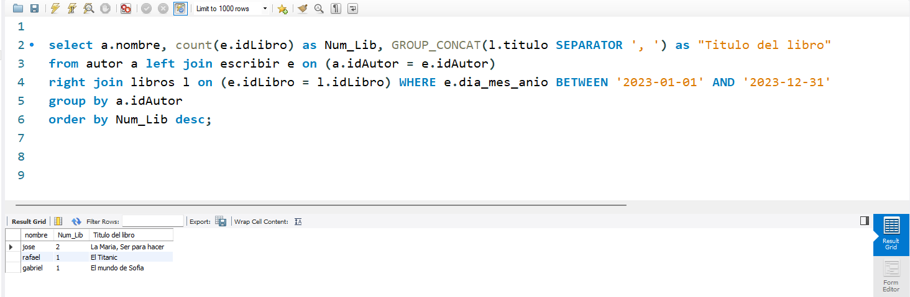
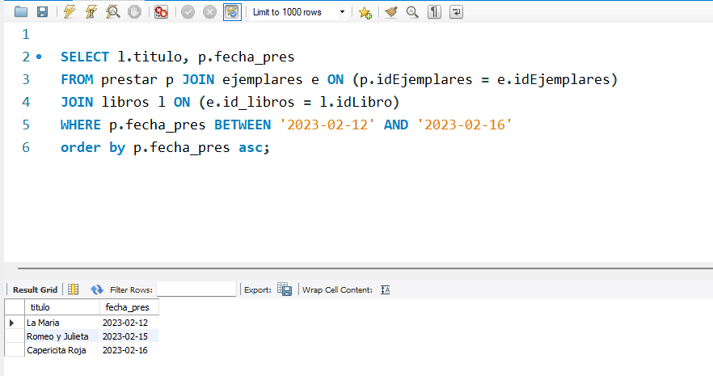

# BASE DE DATOS BIBLIOTECA
Trabajo colaborativo de la materia de Base de Datos.
---

<p>

### ¡Ejercicio 4!

A partir del siguiente enunciado, diseñar una base de datos.

"En la biblioteca del centro se manejan fichas de autores y libros. En la ficha de cada autor se tiene el código de autor y el nombre. De cada libro se guarda el código, título, ISBN, editorial y número de página. 

Un autor puede escribir varios libros, y un libro puede ser escrito por varios autores. Un libro está formado por ejemplares. Cada ejemplar tiene un código y una localización. Un libro tiene muchos ejemplares y un ejemplar pertenece sólo a un libro.

Los usuarios de la biblioteca del centro también disponen de ficha en la biblioteca y sacan ejemplares de ella. De cada usuario se guarda el código, nombre, dirección y teléfono. Los ejemplares son prestados a los usuarios. Un usuario puede tomar prestados varios ejemplares, y un ejemplar puede ser prestado a varios usuarios. De cada préstamo interesa guardar la fecha de préstamo y la fecha de devolución".

Realizar las relaciones oportunas entre tablas e insertar cinco registros en cada una de las tablas.

<div>
  
</div>

</p>

<br>

---
<details><summary>Consulta 1</summary>
<p>

#### Obtener el nombre del usuario que presto más libros, y la cantidad de veces que presto un libro

```SQL
  select nombre, count(p.idPrestar) as 'Cantidad de veces que presto un libro'
  from usuarios u join prestar p on(u.idUsuario =p.idUsuario)
  group by p.idUsuario
  order by count(p.idPrestar) desc
  limit 1;
```

<div>
  
</div>

</p>
</details>

<br>

---
<details><summary>Consulta 2</summary>
<p>

#### Obtener el nombre de los autores, la cantidad de libros que escribio en un rango de fecha y el titulo de los libros

```SQL
  select a.nombre, count(e.idLibro) as Num_Lib, GROUP_CONCAT(l.titulo SEPARATOR ', ') as "Titulo del libro"
  from autor a left join escribir e on (a.idAutor = e.idAutor)
  right join libros l on (e.idLibro = l.idLibro) WHERE e.dia_mes_anio BETWEEN '2023-01-01' AND '2023-12-31'
  group by a.idAutor
  order by Num_Lib desc;
```

<div>
  
</div>

</p>
</details>

<br>

---
<details><summary>Consulta 3</summary>
<p>

#### Consultar el título y la fecha de los libros prestados en un rango de fecha

```SQL
  SELECT l.titulo, p.fecha_pres
  FROM prestar p JOIN ejemplares e ON (p.idEjemplares = e.idEjemplares)
  JOIN libros l ON (e.id_libros = l.idLibro)
  WHERE p.fecha_pres BETWEEN '2023-02-12' AND '2023-02-16'
  order by p.fecha_pres asc;
```

<div>
  
</div>

</p>
</details>
